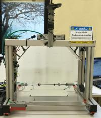
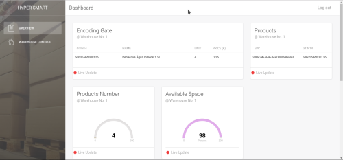
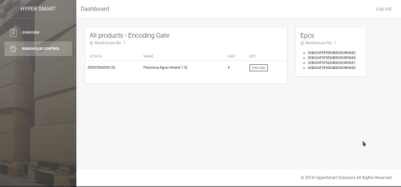

# HyperSmartSolutions

HyperSmart Solutions was developed at [Aveiro University](https://www.ua.pt) in the course [Identification by RFID](http://www.ua.pt/ensino/uc/6700) for academic purposes and intents to improve supermarkets clients buying process.

HyperSmart is a technology that using radio frequency identification can reduce the time spent by the clients in supermarkets payment process and maximize the profit to supermarket groups.
Better for both.

## Built With

* [SGTIN96](http://www.epc-rfid.info/sgtin) - The SGTIN96 specification
* [SGTIN96 - Filter field](http://www.epc-rfid.info/sgtin-filter-values) - The SGTIN96 filter table
* [SGTIN96 - Partition value field](http://www.epc-rfid.info/sgtin-partition-values) - The SGTIN96 partition value table
* [GTIN14 - BARCODE](http://www.gtin.info/itf-14-barcodes/) - The GTIN14 BARCODE fields
* [BARCODE](http://www.gtin.info/itf-14-barcodes/) - BARCODE specification

## Setup

## System General Architecture

## Dashboard Interface
  

## IOS App

## Authors

* **Rafael Almeida** - [GitHub](https://github.com/almeidaRafael94)
* **Fábio Silva** - [GitHub](https://github.com/akaeme)
* **Nelson Reverendo** - [GitHub](https://github.com/nelsonreverendo)
* **Rui Chaves** - [GitHub](https://github.com/ruiac)

## License

This project is licensed under the Apache License - see the [LICENSE.md](LICENSE.md) file for details

